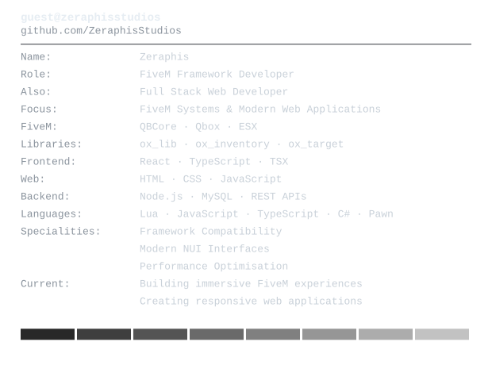

<table>
<tr>
<td valign="top"></td>
<td valign="top"></td>
</tr>
</table>

## Zeraphis Studios

**FiveM Framework Developer · Full Stack Web Developer · UI Engineer**

I build immersive FiveM systems, custom framework integrations and modern
web applications. My work focuses on reliable Lua development, responsive
React interfaces, polished NUI experiences and compatibility across popular
FiveM frameworks.

**Technologies:** Lua, React, TypeScript, TSX, JavaScript, HTML, CSS, C#, Pawn, Node.js, MySQL, QBCore, Qbox, ESX, ox_lib, ox_inventory, ox_target

 

<!-- animated contribution graph, refreshed daily by the workflow -->

